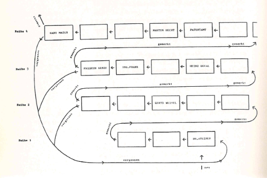

# Learning Patience

This is an implementation of the *Learning Patience* described in Leitner's book *So Lernt Man Lernen* (not to be confused with the much more famous [Leitner System](https://en.wikipedia.org/wiki/Leitner_system)).

## Purpose

The *Learning Patience* is a method to quickly memorize medium-large sets of learning material that is very similar to each other in structure and follow no inherent logic. Such study sets may be:

* phone numbers
* dates
* birthdays
* formulas
* conjugations or other grammar
* similar sounding vocabulary
* abbreviations
* ...

## The Game



*Learning Patience* is essentially rapid mode Spaced Repetition.

## Using This Plugin

### Installation

This plugin is not yet available as community plugin (this will hopefully change in the future).

### Preparation

To use, you need a number of notes formatted like this:

```
front
---
back

#some-specific-tag

```

## Limitations & Roadmap

This plugin is still in early development and does not feel polished yet. Here are some shortcomings that may or may not be improved in the future:

* Notes have to be set up exactly as described above. Alternative templates for denoting the front and back of flash cards or having multiple learning items on a single not are currently unsupported.
* Images on flash cards are currently not working

## Contribute

Contributions of any kind are welcome. Feel free to open an issue if you need help, have ideas or want to know something. 

If you want to modify the plugin, you can simply clone this repository and move it to your plugin directory. It can be run with `npm i` and `npm run dev`, like any plugin based on the [Obsidian Plugin Template](https://github.com/obsidianmd/obsidian-sample-plugin).